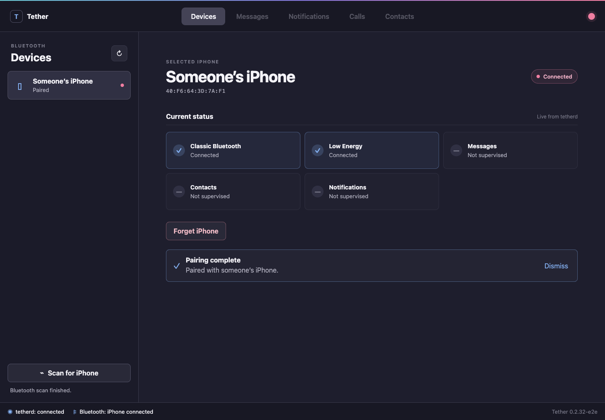

# tether-web

A browser client for [Tether](https://github.com/zackb/tether), the Linux companion for iPhone.

`tether-web` connects to a local `tetherd` Unix socket. The Go service embeds the React application, forwards daemon commands, and publishes daemon events to browsers over server-sent events. Bluetooth behavior remains in `tetherd`.



## Current scope

The first release provides the runtime scaffolding for a web client and the Devices view's guided Bluetooth flow:

- discover a possible iPhone from its Apple Nearby advertisement;
- compare and explicitly confirm the Bluetooth pairing code;
- display Classic, Low Energy, MAP, PBAP, and ANCS status;
- forget an existing Bluetooth pairing;
- recover pairing state after browser or daemon reconnects;
- manage AirPods connection, battery and in-ear state, listening mode, pause-on-removal, and call handoff; and
- discover, approve, connect, and forget Tether peers over Wi-Fi.

This is not yet a complete replacement for Tether's GTK client. Messages, notifications, calls, contacts, settings, file transfer, and other desktop behavior remain future work. See [docs/UI_PARITY.md](docs/UI_PARITY.md).

## Requirements

- A running [`tetherd`](https://github.com/zackb/tether/tree/main/src/daemon) with the `protocol_info`, Bluetooth `operation_id`, and `apple_nearby` protocol additions.
- Read/write access to the `tetherd` Unix socket.
- Node.js 24 and Go 1.24 to build from source.

## Run locally

Build the browser assets and gateway:

```bash
make build
```

Start `tetherd`, then run:

```bash
TETHER_SOCKET_PATH="${XDG_RUNTIME_DIR}/tether/tetherd.sock" \
  ./bin/tether-web
```

The default listener is `127.0.0.1:5135`.

For frontend development, keep the Go gateway running and start Vite in another terminal:

```bash
cd ui
npm ci
npm run dev
```

## Container

The image contains only the static Go gateway and embedded browser assets. It does not include `tetherd`.

```bash
docker build -t tether-web .
docker run --rm \
  -p 127.0.0.1:5135:5135 \
  -v "$XDG_RUNTIME_DIR/tether:/run/tether:rw" \
  -e TETHER_SOCKET_PATH=/run/tether/tetherd.sock \
  -e TETHER_WEB_LISTEN=0.0.0.0:5135 \
  -e TETHER_WEB_ALLOWED_HOSTS=localhost \
  tether-web
```

In Kubernetes, run `tether-web` as a sidecar beside `tetherd` and mount the same runtime volume into both containers.

## Configuration

| Variable | Default | Purpose |
| --- | --- | --- |
| `TETHER_SOCKET_PATH` | `$XDG_RUNTIME_DIR/tether/tetherd.sock` | `tetherd` Unix socket |
| `TETHER_WEB_LISTEN` | `127.0.0.1:5135` | HTTP listen address |
| `TETHER_WEB_ALLOWED_HOSTS` | loopback names only | Comma-separated accepted Host names; required for wildcard listeners |

## Security

`tether-web` currently has no user authentication. The HTTP API can send any supported `tetherd` command and observe daemon events, which may contain private data.

Keep the default loopback listener unless an authenticating reverse proxy or a trusted, firewalled network boundary protects the service. Host validation, same-origin checks, and the absence of CORS access reduce browser-based attacks, but they are not authentication.

Numeric Bluetooth comparison always requires explicit user confirmation. The browser never approves a pairing code automatically.

## Development

```bash
make check       # Go vet/race tests, UI tests, and production build
make test-e2e    # desktop and mobile browser flows
make docker      # standalone container image
```

The gateway intentionally treats daemon JSON as transport data. New features should use commands and events from the upstream [`zackb/tether`](https://github.com/zackb/tether) daemon rather than feature-specific Go HTTP routes. See [docs/ARCHITECTURE.md](docs/ARCHITECTURE.md).

## License

MIT. See [LICENSE](LICENSE).
