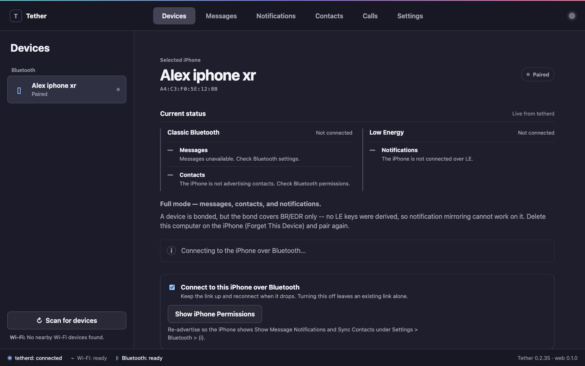
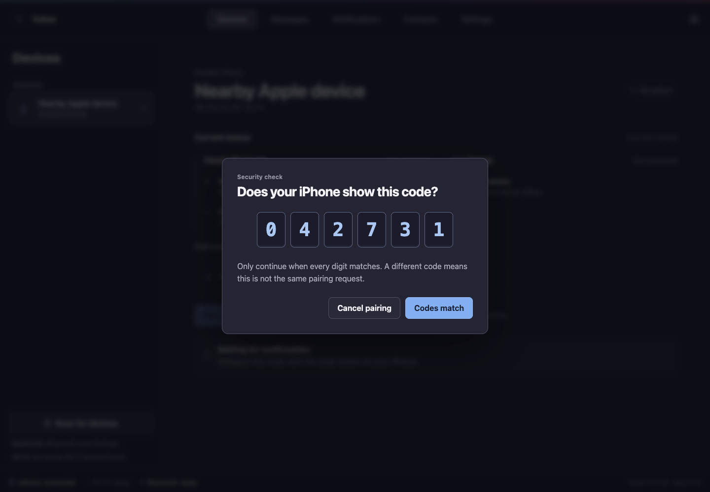
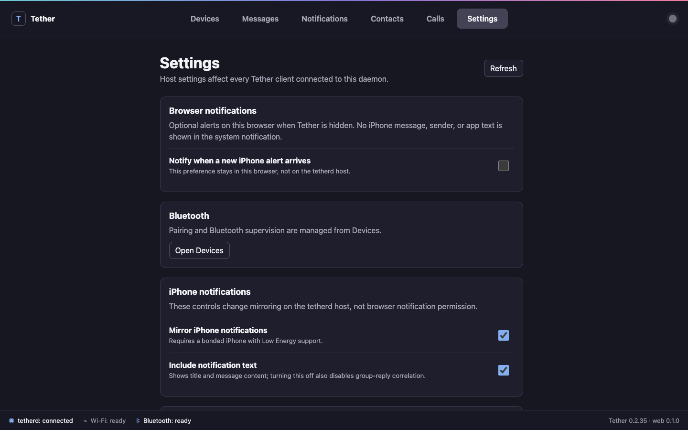

# tether-web

A self-hosted web interface for [Tether](https://github.com/zackb/tether), the Linux companion for iPhone. Run it on your home server and use your iPhone's messages, calls, notifications, contacts and file transfer from any browser.

> [!WARNING]
> tether-web is experimental and has not yet been validated as a replacement for the Tether GTK app on physical phones.



## Features

- **Devices.** Pair an iPhone over Bluetooth, connect Wi-Fi peers, send files and control AirPods.
- **Messages.** Search, read and reply to message threads, with per-thread drafts and contact suggestions.
- **Notifications.** See and dismiss iPhone notifications, with optional browser alerts.
- **Calls.** Dial, answer, decline and hang up calls, and switch audio between the host and the iPhone.
- **Contacts.** Search the phone's address book and start a message thread from a contact.
- **Settings.** Configure notification mirroring, call controls and message retention.
- **Works on phones and desktops.** The layout adapts to small screens.

[docs/UI_PARITY.md](docs/UI_PARITY.md) tracks each view against the GTK app. [future-features.md](future-features.md) lists upstream Tether features that tether-web does not support yet.

## How it works

tether-web is a small Go server that embeds a React app. It talks to `tetherd`, Tether's daemon, over a Unix socket. `tetherd` handles Bluetooth, Wi-Fi peers and your data, so tether-web needs no Bluetooth access of its own.

```text
Browser  ──HTTPS──>  tether-web  ──Unix socket──>  tetherd  ──>  BlueZ  ──>  iPhone
```

## Requirements

- A Linux host with a working Bluetooth adapter, BlueZ and D-Bus. Wi-Fi peer discovery also needs Avahi.
- [Tether](https://github.com/zackb/tether) 0.2.35 or newer.
- Docker Engine with Compose (amd64 or arm64), or Go 1.24 and Node.js 24 to build from source.

Complete Tether's [Bluetooth host setup](https://github.com/zackb/tether/blob/main/docs/BLUETOOTH.md) before pairing a phone.

## Install

### Docker Compose (recommended)

The [Compose example](deploy/docker-compose.yml) runs `tetherd` and tether-web as two non-root containers that share a private runtime directory. Both images are published for amd64 and arm64:

| Image | Contents |
| --- | --- |
| `ghcr.io/napisani/tether-web` | [tether-web releases](https://github.com/napisani/tether-web/releases) |
| `ghcr.io/napisani/tether-core` | An unofficial build of an unmodified upstream Tether release. Upstream publishes no image. |

Follow [deploy/README.md](deploy/README.md) to check the host, create the data directories and password file, and start both services. The short version, once `deploy/.env` is filled in:

```sh
compose() { docker compose --env-file deploy/.env -f deploy/docker-compose.yml "$@"; }
compose pull
compose up -d
```

Then open <http://127.0.0.1:5135/> and sign in with the username and password you configured.

### Docker, with an existing `tetherd`

If `tetherd` already runs on the host, run only the web container and mount the directory that holds its socket. The password file must be readable by UID 1000 and contain at least 16 random bytes.

```sh
docker run -d --name tether-web \
  -p 127.0.0.1:5135:5135 \
  -v "$XDG_RUNTIME_DIR/tether:/run/tether:rw" \
  -v /path/to/tether-web-password:/run/secrets/tether-web-password:ro \
  -e TETHER_SOCKET_PATH=/run/tether/tetherd.sock \
  -e TETHER_WEB_LISTEN=0.0.0.0:5135 \
  -e TETHER_WEB_ALLOWED_HOSTS=localhost \
  -e TETHER_WEB_AUTH_USER=owner \
  -e TETHER_WEB_AUTH_PASSWORD_FILE=/run/secrets/tether-web-password \
  ghcr.io/napisani/tether-web:latest
```

### From source

```sh
make build
TETHER_SOCKET_PATH="$XDG_RUNTIME_DIR/tether/tetherd.sock" ./bin/tether-web
```

The server listens on `127.0.0.1:5135` by default. A loopback listener needs no password.

### Kubernetes

Run tether-web as a sidecar in the `tetherd` pod. Mount the same disk-backed runtime volume into both containers and run them as the same non-root UID. Give the volume at least 1 GiB, because the gateway stages up to two 256 MiB browser uploads beside the socket before handing them to `tetherd`. Do not mount Tether's `/data` or `/downloads` into the web container.

## Configuration

| Variable | Default | Purpose |
| --- | --- | --- |
| `TETHER_SOCKET_PATH` | `$XDG_RUNTIME_DIR/tether/tetherd.sock` | Path to the `tetherd` Unix socket |
| `TETHER_WEB_LISTEN` | `127.0.0.1:5135` | HTTP listen address |
| `TETHER_WEB_ALLOWED_HOSTS` | loopback names only | Comma-separated Host names to accept. Required for wildcard listeners such as `0.0.0.0`. |
| `TETHER_WEB_AUTH_USER` | unset | HTTP Basic username. Required for non-loopback listeners. |
| `TETHER_WEB_AUTH_PASSWORD_FILE` | unset | File containing the HTTP Basic password (16 to 4096 bytes). Required for non-loopback listeners. |

`/healthz` reports that the server is running and `/readyz` reports that it is connected to `tetherd`. Both are unauthenticated for container health checks.

## Remote access and security

Anyone who can sign in to tether-web can read your messages, notifications and live call data, and can send any command `tetherd` supports. Treat it like the phone itself.

- Keep the port bound to `127.0.0.1` and put an HTTPS reverse proxy in front of it for remote access. Add the proxy's Host name to `TETHER_WEB_ALLOWED_HOSTS`. HTTP Basic credentials must never cross a network in plain HTTP.
- tether-web refuses to start on a non-loopback address without a username and password file.
- Mount the password file as a read-only secret. Do not put the password in the image, the command line, `.env` or Git.
- There is one owner. Every signed-in browser has the same access.
- Bluetooth pairing always asks you to confirm the six-digit code. The browser never accepts one automatically.

## Updating

tether-web and Tether core are versioned separately. Pin both image tags in `deploy/.env`, read the release notes, and back up Tether's `/data` directory before changing the core tag. Then:

```sh
compose pull
compose up -d
```

See the [upgrade and backup notes](deploy/README.md#operate-and-troubleshoot) for details.

## Screenshots

| Pairing | Settings |
| --- | --- |
|  |  |

## Contributing

Bug reports and pull requests are welcome. [future-features.md](future-features.md) lists upstream features that still need a web implementation.

tether-web is a client of `tetherd`, not a second implementation of Tether. New features use the daemon's existing commands and events, and each view mirrors its counterpart in the [Tether GTK app](https://github.com/zackb/tether/tree/main/src/gtk). Read [docs/ARCHITECTURE.md](docs/ARCHITECTURE.md) before starting, and update [docs/UI_PARITY.md](docs/UI_PARITY.md) when a view changes.

```sh
make build       # Build the UI and the ./bin/tether-web server
make check       # Lint, Go vet and race tests, UI tests, and a production build
make test-e2e    # Playwright flows against a fake tetherd, desktop and mobile
make docker      # Build a local container image
```

The end-to-end tests run the real Go server against a fake daemon, so you do not need a phone or Bluetooth adapter to work on most features. Maintainers publish releases by pushing a `vX.Y.Z` tag. See [docs/RELEASING.md](docs/RELEASING.md).

## License

MIT. See [LICENSE](LICENSE).

tether-web depends on [Tether](https://github.com/zackb/tether) by Zack Bartel.
